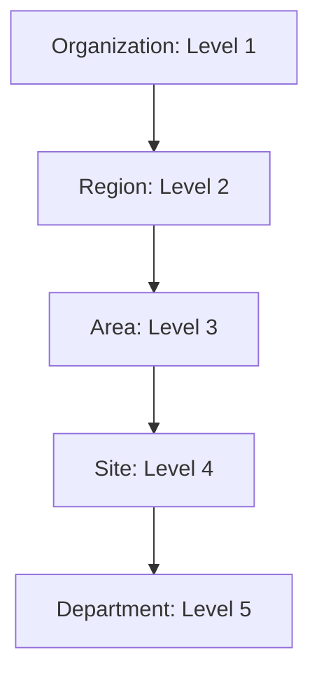

# react-enterprise-rbac

<p align="center">
  <strong>The Ultimate Enterprise Authorization Framework for React & TypeScript.</strong>
</p>

<p align="center">
  Built to solve complex hierarchical access control, multi-tenant security, and type-safe permission management in modern enterprise applications.
</p>

<p align="center">
  <a href="https://github.com/rupendrajangid/react-enterprise-rbac/actions/workflows/ci.yml">
    
  </a>
  <a href="https://www.npmjs.com/package/@react-enterprise-rbac/react">
    
  </a>
  <a href="https://www.npmjs.com/package/@react-enterprise-rbac/react">
    
  </a>
  
  
</p>

---

## ✨ Why react-enterprise-rbac?

Enterprise applications don't just need "Admin" vs "User". They need to manage access across **Organizations**, **Regions**, **Sites**, and **Departments**, often with permissions that flow downward through the hierarchy.

`react-enterprise-rbac` provides a production-grade, generic-first engine that handles:
* **Hierarchical Scope Inheritance**: Permissions granted at a "Region" level automatically cascade to child "Sites" and "Departments".
* **Wildcard Permission Matching**: Use `task.*` to grant all task-related permissions with a single string.
* **Strict Type Safety**: Full TypeScript generic support ensures your custom permission enums are enforced at compile-time.
* **Multi-Tenant Ready**: Designed from the ground up for SaaS and multi-organization enterprise systems.

---

## 📦 Monorepo Packages

This framework is split into specialized, tree-shakable packages to keep your bundle light:

| Package | Purpose |
| :--- | :--- |
| [`@react-enterprise-rbac/core`](./packages/core) | The foundational authorization and hierarchy engine. |
| [`@react-enterprise-rbac/react`](./packages/react) | Providers, hooks, and declarative UI guards for React. |
| [`@react-enterprise-rbac/jwt`](./packages/jwt) | Bridge for extracting permissions and scopes from standard JWT tokens. |
| [`@react-enterprise-rbac/middleware`](./packages/middleware) | Server-side authorization helpers for Node.js backends. |

---

## 🚀 Quick Start

### 1. Installation

```bash
npm install @react-enterprise-rbac/react @react-enterprise-rbac/core
```

### 2. Define Your Permissions (Optional but Recommended)

```typescript
type MyPermissions = 'user.view' | 'user.edit' | 'report.*' | 'admin.panel';
```

### 3. Wrap Your Application

```tsx
import { RBACProvider } from '@react-enterprise-rbac/react';

const user = {
  id: 'u-123',
  roles: ['manager'],
  permissions: ['user.view'], // Direct permissions
  scopes: [
    { type: 'region', id: 'north-america', permissions: ['report.*'] } // Scoped permissions
  ]
};

function App() {
  return (
    <RBACProvider user={user}>
      <Dashboard />
    </RBACProvider>
  );
}
```

### 4. Guard Your UI

```tsx
import { Can, ScopeGuard } from '@react-enterprise-rbac/react';

function Dashboard() {
  return (
    <div>
      {/* Direct permission check */}
      <Can<MyPermissions> permission="user.view">
        <UserList />
      </Can>

      {/* Hierarchical scope check (inherited downward) */}
      <ScopeGuard<MyPermissions> 
        scope="site" 
        scopeId="NYC-01" 
        permission="report.view"
      >
        <SiteReport />
      </ScopeGuard>
    </div>
  );
}
```

---

## 🏢 Hierarchical Resolution Engine

The engine resolves access based on a numeric hierarchy level system.



Permissions granted at **Region (Level 2)** are automatically recognized when checking for access at **Site (Level 4)**, provided the Site belongs to that Region.

---

## 🧪 Development & Testing

We maintain high standards for code quality and stability.

```bash
# Install dependencies
npm install

# Run type-safe builds across all packages
npm run build

# Run unit tests for the core engine
npm run test

# Lint the entire codebase
npm run lint
```

---

## 🗺️ Roadmap

- [x] Hierarchical Scope Inheritance
- [x] Wildcard Matching
- [x] Generic Type Support
- [x] JWT Integration Utilities
- [ ] **Next**: Attribute-Based Access Control (ABAC)
- [ ] **Next**: Permission Visualizer DevTools
- [ ] **Future**: Native Next.js App Router Middleware
- [ ] **Future**: Audit Logging Adapters

---

## 🤝 Contributing

Contributions are what make the open-source community such an amazing place to learn, inspire, and create. Any contributions you make are **greatly appreciated**.

1. Fork the Project
2. Create your Feature Branch (`git checkout -b feature/AmazingFeature`)
3. Commit your Changes (`git commit -m 'Add some AmazingFeature'`)
4. Push to the Branch (`git push origin feature/AmazingFeature`)
5. Open a Pull Request

---

## 📄 License

Distributed under the MIT License. See `LICENSE` for more information.

---

<p align="center">
  Built with ❤️ for the Enterprise React Ecosystem.
</p>
