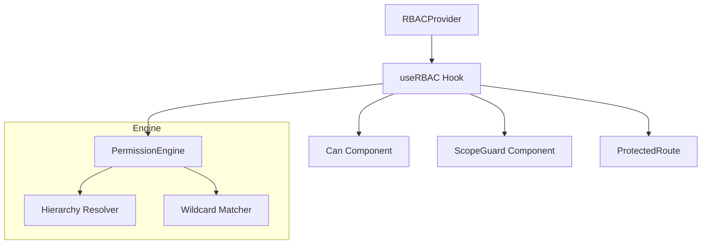

# Architecture Design: react-enterprise-rbac

## Core Principles

1.  **Decoupled Logic**: The core engine is platform-agnostic (written in pure TypeScript).
2.  **Hierarchical Resolution**: Support for complex organizational structures with automatic downward inheritance.
3.  **Type Safety**: Generic-first API for compile-time permission validation.
4.  **Extensibility**: Foundation for future ABAC (Attribute-Based Access Control) support.

## Component Hierarchy



## Data Flow

1.  **Hydration**: User metadata (roles, permissions, scopes) is fetched and passed to `RBACProvider`.
2.  **Engine Initialization**: `PermissionEngine` is created with hierarchy configuration.
3.  **Check Request**: Components/Hooks call `can()` or `canAccess()`.
4.  **Resolution**:
    -   Global permission check (wildcard matching).
    -   Role-based resolution (if configured).
    -   Scope-based resolution (traverses hierarchy upward to find access).

## Hierarchical Logic

The engine uses a numeric level system for scopes:
-   `org` (1)
-   `region` (2)
-   `area` (3)
-   `site` (4)
-   `department` (5)

Access at level `N` implies access to level `N+1` if the relationship is established in the user's scope metadata.

## Future: ABAC

Planned expansion into ABAC will allow conditions like:
```ts
can(user, 'task.edit', { taskId: '123', ownerId: user.id })
```
This will be implemented by adding a `rules` engine to the core package.
